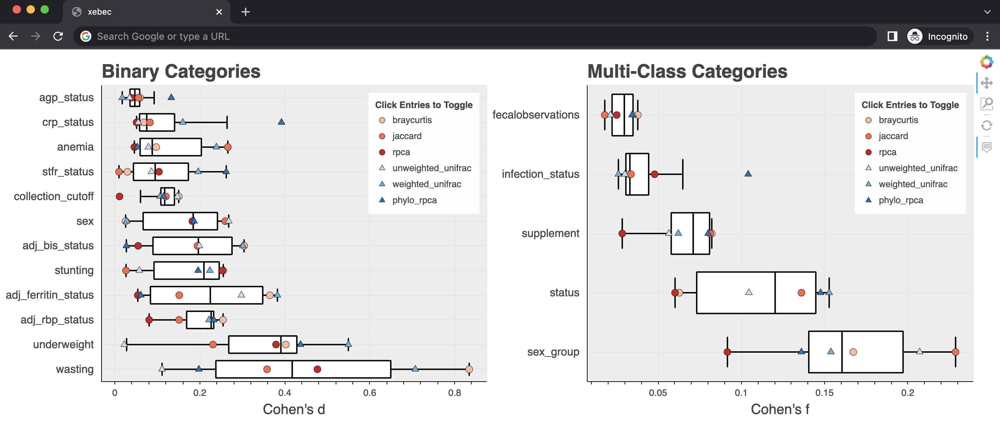
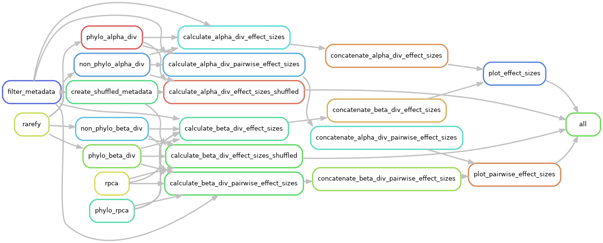

# xebec

Snakemake pipeline for microbiome diversity effect size benchmarking

**NOTE**: Please note that xebec is still under active development.

## Installation

To use xebec, you will need several dependencies:

* snakemake
* cookiecutter
* unifrac
* scikit-bio
* pandas
* bokeh
* evident
* gemelli

We recommend using `conda`/`mamba` to install these packages when possible.
Note that at time of writing, evident and gemelli are only available through PyPi.

From the command line, run the following command:

```
cookiecutter https://github.com/gibsramen/xebec
```

You should enter a prompt where you can input the required values to setup xebec.

* `project_name`: Name of the directory to create with the Snakemake pipeline files (defaults to `diversity-benchmark`).
* `feature_table_file`: *absolute* path to the feature table to be used in BIOM format.
* `sample_metadata_file`: *absolute* path to the sample metadata file to be used in TSV format.
* `phylogenetic_tree_file`: *absolute* path to the phylogenetic tree file to be used in Newick format.
* `max_category_levels`: Maximum number of levels in a category to consider. Any categories with more than this number of levels will be dropped (defaults to 5).
* `min_level_count`: Minimum number of samples in a given level to continue. If a level is represented by fewer than this many samples, this level will be set to NaN (defaults to 3).
* `rarefaction_depth_percentile`: Depth percentile at which to rarefy for diversity metrics that require it (defaults to 0.1 or 10th percentile).

This will create the directory structure needed to run xebec under the project name you specified.

The directory structure should be as follows:

```
diversity-benchmark/
├── config
│   ├── alpha_div_metrics.tsv
│   ├── beta_div_metrics.tsv
│   └── config.yaml
└── workflow
    ├── rules
    │   ├── alpha_diversity.smk
    │   ├── beta_diversity.smk
    │   ├── evident.smk
    │   ├── preprocess_data.smk
    │   └── visualization.smk
    └── Snakefile

3 directories, 9 files
```

## Usage

Navigate inside the `<project_name>` directory.
To start the pipeline , run the following command:

```
snakemake --cores 1
```

You should see the Snakemake pipeline start running the jobs.
If this pipeline runs sucessfully, the processed results will be located at `<project_name>/results`.
Open the `results/beta_div/effect_size_plot.html` and `results/alpha_div/effect_size_plot.html` webpages and you should be taken to an interactive visualization.
On the left are the effect sizes of diversity differences for binary categories.
On the right are the effect sizes of diversity differences for multi-class categories.
You can move around these plots, zoom in, as well as toggle the visibility of diversity metrics by clicking on the legend.
These plots are generated using [Bokeh](https://github.com/bokeh/bokeh).



## Workflow Overview

xebec performs four main steps, some of which have substeps.

1. Process data (filter metadata, rarefaction)
2. Run diversity analyses
3. Calculate effect sizes (concatenate together)
4. Generate visualizations

An overview of the DAG is shown below:


